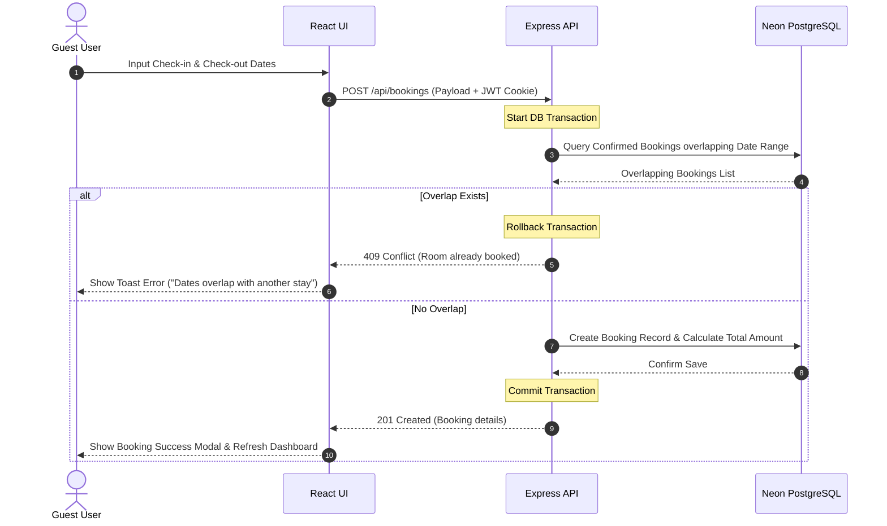

# Features and Architecture Guide

This document describes the design, operational workflows, role permissions, and database models of the Hotel Booking System.

---

## 1. System Feature Matrix

The application coordinates features across three primary tiers:

### Frontend (FE)
- **Interactive Room Catalog:** A browseable gallery of hotel rooms featuring search and dynamic filter controls (filter by type, capacity, price, and date range).
- **Responsive Calendar Booking:** Interactive form interfaces for reserving rooms, automatically disabling dates in the past and verifying inputs in real time.
- **Dynamic Booking History:** A structured panel showing past, current, and upcoming reservations, with intuitive badges indicating status.
- **Modals via React Portals:** Form dialog overlays mounted to the document body to prevent z-index stacking issues during transitions.
- **Star Rating Feedback Form:** Guest review submissions enabled dynamically after a checkout date has passed.
- **Clean Theme Toggle:** Dark/light mode switch featuring accessible contrast ratios complying with WCAG guidelines.

### Backend (BE)
- **Controller-Service Architecture:** Strict segregation of routing, controller HTTP handling, and service-based business logic.
- **Double Booking Prevention:** Database-level transaction verification to prevent overlapping date reservations.
- **Forgot Password Workflow:** Complete password reset mechanism, generating secure, short-lived tokens and returning email simulation parameters (Ethereal SMTP preview URLs).
- **Global Error Handling:** Centralized Express middleware returning standard JSON error responses and preventing stack trace exposure in production.

### Database (DB)
- **Prisma Integration:** Type-safe database queries mapped to relational PostgreSQL models.
- **Optimal Schema Design:** Integrated compound indexes on time and identification columns to speed up query execution under high read conditions.
- **Relational Integrity:** Cascading deletes on auth profiles to clean up dependent booking records automatically.

---

## 2. Security and Privacy Implementations

- **JSON Web Tokens (JWT):** Signed user sessions transmitted using secure `HttpOnly` and `SameSite` cookies to prevent Cross-Site Scripting (XSS) and Session Hijacking.
- **Password Hashing:** Strict hashing using `bcrypt` to protect raw user credentials.
- **Helmet Headers:** Automated middleware injection setting HTTP response headers (e.g., Content Security Policy, X-Frame-Options) to secure against Clickjacking and code injection.
- **Express Rate Limiting:** Global rate limiters preventing Denial of Service (DoS) and brute force login attempts (bypassed automatically in test/development environments).
- **CORS Configuration:** Explicitly configures permitted origins using the backend environment parameters, loaded ahead of the rate limit middleware to avoid preflight failures.

---

## 3. Core Operational Workflows

### A. User Registration & Login
1. Guests input their name, email, and password.
2. The password is validated against strength criteria (Zod) on the client, hashed via `bcrypt` on the server, and saved.
3. Upon successful login, the server generates a JWT, signs it using `JWT_SECRET`, and sends it to the browser as a secure cookie.

### B. Prevention of Double Bookings
1. During a booking request, the service initiates a database transaction.
2. The logic evaluates the overlap constraint for the requested `roomId`:
   `requestedCheckIn < existingCheckOut AND requestedCheckOut > existingCheckIn`
3. If any record matches this condition, the transaction rolls back immediately and returns a `409 Conflict` status.
4. If no conflict exists, the total cost is calculated (`nights * pricePerNight`), the booking is created, and the transaction commits.

### C. Password Reset Lifecycle
1. The user requests a reset by entering their email address.
2. The backend generates a secure token, hashes it, saves it to `PasswordResetToken` with a 1-hour expiration, and initiates a mock SMTP request.
3. The response returns a simulated Ethereal Email URL, enabling local testing.
4. The user navigates to the reset page using the token, enters a new password, and resets their account access.

### D. Guest Feedback (Reviews)
1. Users view completed stays in their history.
2. If the check-out date is in the past, a **Leave Feedback** button is rendered.
3. The guest submits a rating (1-5) and comment. The backend confirms ownership of the booking before saving the review.

---

## 4. Role-Based Access Control (RBAC)

The application enforces permissions based on `UserRole` attributes:

| Operation | User Role Required | API Endpoint Protected |
|---|---|---|
| Browse Rooms | Guest (No Auth) / User / Admin | `GET /api/rooms` |
| View Room Details | Guest (No Auth) / User / Admin | `GET /api/rooms/:id` |
| Book a Room | Authenticated User / Admin | `POST /api/bookings` |
| View Own Bookings | Authenticated User / Admin | `GET /api/bookings/my` |
| Cancel Booking | Booking Owner / Admin | `PATCH /api/bookings/:id/cancel` |
| Leave Room Feedback | Booking Owner (Post-Checkout) | `POST /api/bookings/:id/reviews` |
| Create a Room | Admin Only | `POST /api/rooms` |
| View All Bookings | Admin Only | `GET /api/bookings/all` |
| View All Users | Admin Only | `GET /api/users` |

---

## 5. User Interface & Layout Design

- **Glassmorphism Aesthetic:** Transparent styling using CSS backdrop blur filters (`backdrop-blur-md`), thin borders, and subtle shadow overlays for a premium interface.
- **Theme Switcher:** Pure CSS styling driven by a data attribute (`data-theme="dark"`). Colors adapt dynamically (using variables in `index.css`) to ensure consistent visibility.
- **Responsive Layout:** CSS Grid and Flexbox configurations adapt content tables into readable card lists on mobile screens.

---

## 6. Database Schema Specification

The application models are structured in `schema.prisma` as follows:

### User Table
- `id` (String, UUID, Primary Key)
- `name` (String)
- `email` (String, Unique Index)
- `passwordHash` (String)
- `role` (Enum `UserRole`: `USER`, `ADMIN`)
- `createdAt` / `updatedAt` (DateTime)

### Room Table
- `id` (String, UUID, Primary Key)
- `roomNumber` (String, Unique Index)
- `type` (String)
- `capacity` (Integer)
- `pricePerNight` (Decimal, 10, 2)
- `description` (String, Optional)
- `createdById` (String, Foreign Key -> User)

### Booking Table
- `id` (String, UUID, Primary Key)
- `roomId` (String, Foreign Key -> Room)
- `userId` (String, Foreign Key -> User)
- `guestName` (String)
- `guestEmail` (String)
- `checkInDate` (DateTime)
- `checkOutDate` (DateTime)
- `totalAmount` (Decimal, 10, 2)
- `status` (Enum `BookingStatus`: `CONFIRMED`, `CANCELLED`)
- *Indexes:* `[roomId, checkInDate, checkOutDate]`, `[userId, createdAt]`

### Review Table
- `id` (String, UUID, Primary Key)
- `bookingId` (String, Unique Foreign Key -> Booking)
- `roomId` (String, Foreign Key -> Room)
- `userId` (String, Foreign Key -> User)
- `rating` (Integer, 1 to 5)
- `comment` (String, Optional)
- *Indexes:* `[roomId, createdAt]`

### PasswordResetToken Table
- `id` (String, UUID, Primary Key)
- `tokenHash` (String, Unique Index)
- `userId` (String, Foreign Key -> User)
- `expiresAt` (DateTime)
- `usedAt` (DateTime, Optional)
- *Indexes:* `[userId, expiresAt]`
